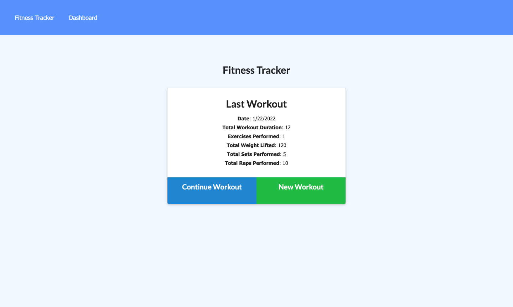
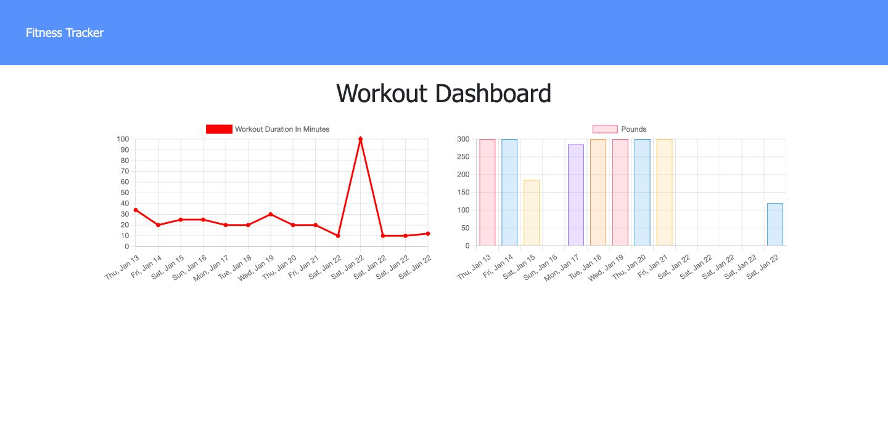
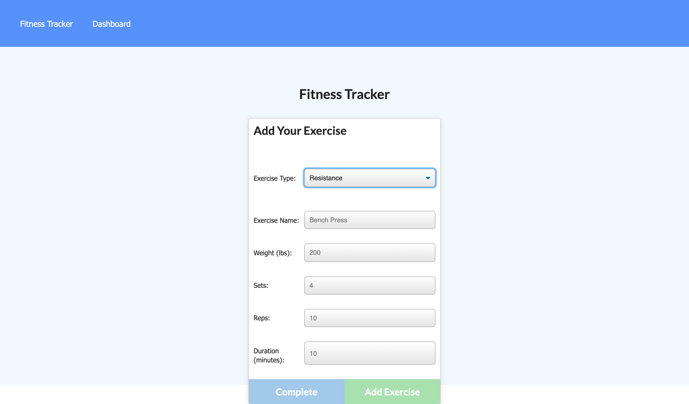

Homework 18 - Fitness Tracker

## Description

This project helps to record different workouts done by an individual. The user is able to add either a cardio or a resistance exercise. For a cardio exercise, they can record the activity done, the miles they went and how long it took. For a resistance exercise, they are able to track the activity, weight, reps, and duration. If the user looks at their dashboard they see a chart that shows the amount of time they have worked out during a span of time. There is another chart that shows the amount of weight per day they worked out.

## Table of Contents

- [Installation](#installation)
- [Usage](#usage)
- [License](#license)
- [Contributing](#contributing)
- [Tests](#tests)
- [Questions](#questions)

## Installation

To install the necessary dependencies, run the following command:
npm i

## Usage

Repo instructions: Once all of the dependencies have been installed, run "node server.js" from the terminal and it will run on localhost:3000.

## License

This project doesn't have a license.

## Contributing

Contributing is not allowed at this time.

## Tests

There are no tests at this time.

## Questions

If you have any questions about the repo, reach out to me directly at katie.wine2@gmail.com. See more of my work at https://www.github.com/kmwine02

## Links

The repo can be found here: https://github.com/kmwine02/homework10-team-profile-generator
The live site can be found here: https://kmwine02-homework18-workout-tr.herokuapp.com/

